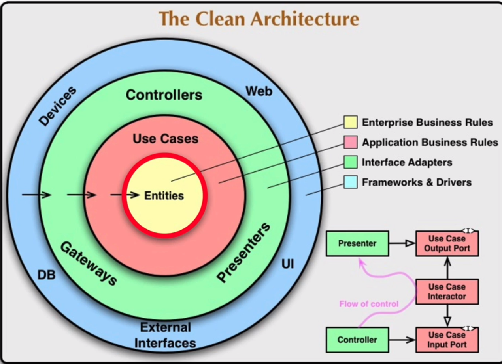
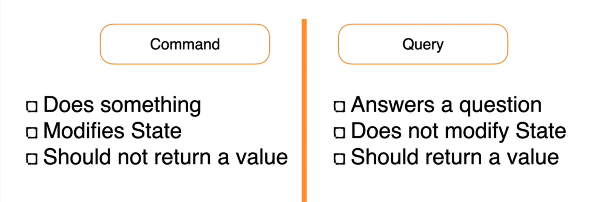
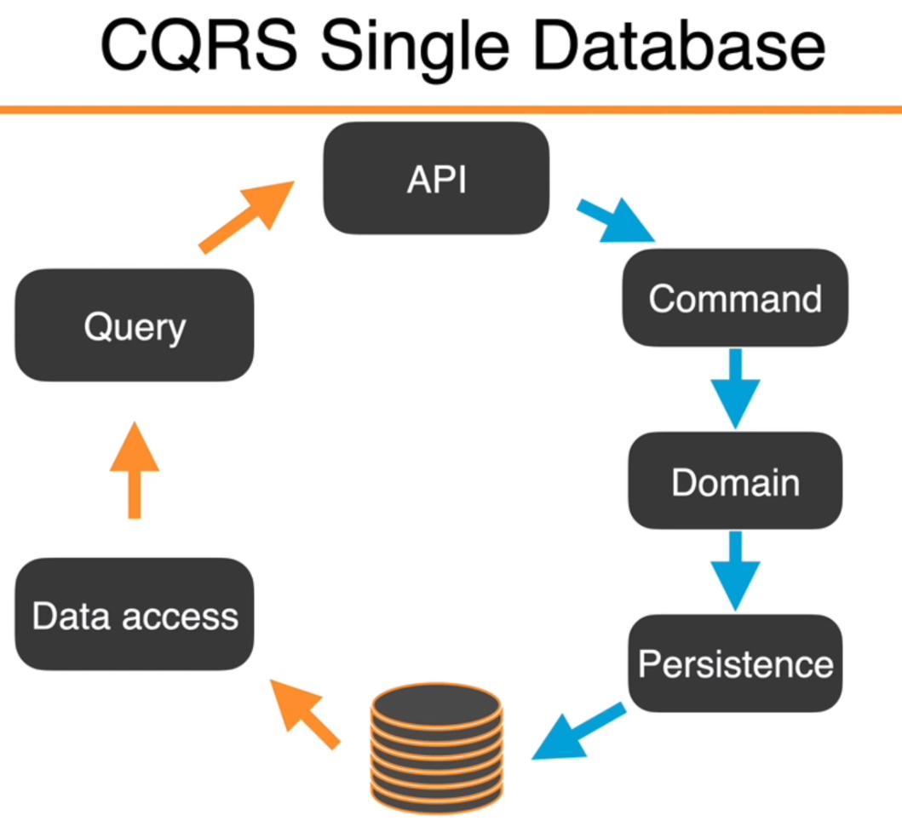
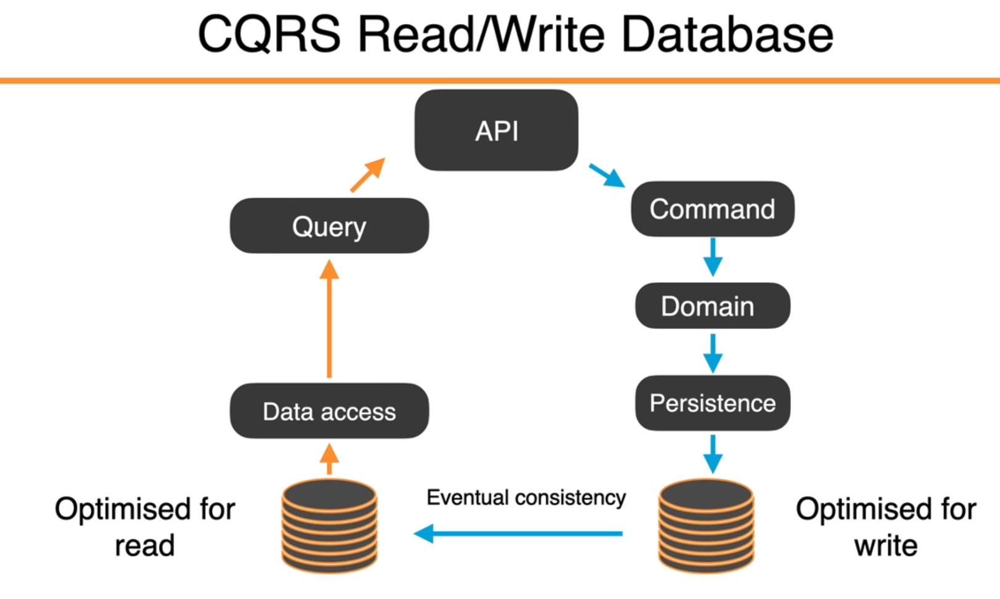

- .NET Core is a cross-platform, `open-source framework` developed by Microsoft that can be used to develop a variety of application types, including web applications (`using ASP.NET Core`), desktop applications, cloud services, and more. Advantages of developing with .NET Core include good performance, cross-platform capabilities (it can run on Windows, Linux, and MacOS), and rich library support.

- Node.js is an open-source, cross-platform `JavaScript runtime environment based on Chrome's V8 JavaScript engine`. It allows JavaScript to be run outside the browser on the server side. Node.js has an extremely rich package manager, npm, and a vibrant community with a large number of open-source libraries available for use.

As for Express.js and ASP.NET, they are web development frameworks built on these platforms:

- Express.js is a minimalistic and flexible web application development framework based on the Node.js platform. It provides a series of powerful features to help you create a variety of web and mobile device applications.

- ASP.NET Core is a framework for building web applications that's built on .NET Core. It uses a Model-View-Controller (MVC) design pattern and is easy to test, has powerful routing features, and offers good support for RESTful services, among other features.


# .NET Core CLI

## dotnet restore

The `dotnet restore` is a command within the .NET Core Command Line Interface (CLI) used for restoring the dependencies of a project. In .NET Core, dependencies for a project are typically defined in the project file or a `*.deps.json` file.

When you run the `dotnet restore` command, the .NET CLI reads the project file, identifies the NuGet packages that the project depends on, and downloads them to your machine. This process is known as "restoring".

If any packages can't be downloaded, or there's a mismatch between the versions of the packages defined in the project file and the `*.deps.json` file, the `dotnet restore` command will return an error message.

This command is useful in scenarios like when you've just checked out a project from a version control system (like git) or you've added a new NuGet package dependency to your project. In these cases, you would need to run `dotnet restore` to ensure that your project can locate all its necessary dependencies properly.

As of .NET Core 2.0, this command is not necessary in most cases, as commands such as `dotnet build` and `dotnet run` will automatically perform restore operations. However, if you need to perform a restore operation separately, or you wish to explicitly perform a restore operation in a Continuous Integration/Continuous Deployment (CI/CD) environment, you can still use the `dotnet restore` command.

## dotnet watch --no-hot-reload

The `dotnet watch` command is a tool that runs a .NET Core CLI command when source files change. This command is particularly useful when you want to test, build, or run code every time you make changes in your .NET project. 

The `--no-hot-reload` option is used to disable hot reload for `dotnet watch`. Hot Reload is a feature that was introduced in .NET 6.0, which allows developers to modify their application's source code while it's running, without requiring them to manually pause or hit a breakpoint.

Hot Reload can be very helpful for speeding up development because it eliminates the need to manually stop and restart your application every time you make a change. But, if for some reason, you do not want to use this feature, or it is causing issues with your specific application, you can disable it by using the `--no-hot-reload` option.

In summary, the command `dotnet watch --no-hot-reload` will watch your files for changes and automatically re-run the project every time a file is changed, without using the Hot Reload feature.


# Architecture


In a typical .NET full-stack application, you might encounter the following parts:

1. **Client-App:** This layer is usually the client-side application, the part that a user interacts with directly. It could be a Web application (utilizing HTML, CSS, JavaScript, etc.), a desktop application (using WPF, WinForms, etc.), or a mobile application (using Xamarin, MAUI, etc.). The client application is responsible for taking user input, sending it to the server-side (API), and presenting data received from the server to the user.

2. **API:** This layer serves as the entry point on the server-side, handling all incoming requests from the client. The API layer routes HTTP requests to appropriate handlers (like controllers) and formats data into HTTP responses. It may also handle cross-cutting concerns such as authentication, authorization, logging, exception handling, etc.

3. **Application:** This layer contains the core part of the business logic, such as services, commands, queries, etc. It deals with business rules and workflows and orchestrates interactions between the Domain layer and the Infrastructure layer.

4. **Domain:** The Domain layer includes the heart of the business model. It contains all the concepts of the business domain, such as entities, value objects, domain events, domain services, etc. The Domain layer is the core of the business logic, but it is ignorant of the existence of the Application and Infrastructure layers, and it does not depend on them.

5. **Persistence:** Also referred to as the data access layer, this layer mainly interacts with the database, including database connections, CRUD (Create, Read, Update, Delete) operations of data, etc. It typically uses an Entity Framework or another ORM tool to simplify data operations.

6. **Infrastructure:** The Infrastructure layer provides support for other layers to interact with external systems or services, like the file system, email service, message queues, network requests, etc. This layer provides services to other layers but doesn't partake directly in the processing of business logic.

These parts work together to deliver full-stack functionality. Each has its responsibilities, and by working together, the code becomes easier to manage and maintain, and the application becomes more scalable.


Consider drawing a diagram with the following layers, from bottom to top:

1. **Persistence / Database:** This is the lowest layer and represents the data storage.

2. **Infrastructure:** This layer interacts directly with the Persistence layer and might have outgoing arrows to external systems (like email servers, file servers, etc.).

3. **Domain:** This layer sits on top of the Infrastructure layer and contains business logic and business rules.

4. **Application:** This layer is above the Domain layer and orchestrates the workflow of business operations.

5. **API:** This is the entry point on the server-side and should be depicted as interfacing between the Application layer and the Client-App layer.

6. **Client-App:** This is the topmost layer that interacts directly with the user. 

Arrows can be used to denote the interaction between the layers: 

- The Client-App sends requests to the API.
- The API utilizes services in the Application layer.
- The Application layer leverages the Domain for business rules and Infrastructure for interactions with external systems.
- The Infrastructure interacts with the Persistence layer for data operations.


Compared to .NET project structure, Spring Boot (and the broader Java ecosystem) typically has the following structure:

1. **Model/Domain**: This layer roughly corresponds to the Domain layer in .NET and contains the basic entities or objects within the business domain. For example, for a banking application, there might be classes like Account, User, etc.

2. **Repository/DAO (Data Access Object)**: This layer corresponds to the Persistence and parts of the Infrastructure layer in .NET. It contains all the code interacting with the database, such as CRUD operations. In Spring, the Repository interface of Spring Data JPA is usually used to simplify development.

3. **Service**: The Service layer corresponds to parts of the Domain and Application layers in .NET. It contains the main business logic, and all transaction management is handled at this layer.

4. **Controller**: The Controller layer corresponds to the API layer in .NET. This is where HTTP requests from users are received and processed, invoking the Service layer for processing and finally returning a response.

5. **DTO (Data Transfer Object)**: DTOs are not mandatory but are used in many applications, especially in web services. DTOs are used for data transfer between the Controller and Service layers, and between the Service layer and the Repository/DAO layer. They correspond to ViewModels or DTOs in .NET.

6. **Client-App**: This part is not common in Spring Boot applications because Spring Boot primarily focuses on backend services. However, in a complete application, this part corresponds to the Client-App layer in .NET, which may include a web front-end (HTML/CSS/JavaScript), desktop applications, mobile applications, etc. These applications communicate with the backend services through APIs.

Above are the main architectural differences between Spring Boot and .NET. It's important to note that these two technologies are largely complementary, and both can be used to build complex enterprise-level applications. You should choose the most suitable technology based on the specific project requirements and team skills.


# API


1. **Program.cs** file:

   - The method `WebApplication.CreateBuilder(args)` is used to initiate a new web application builder. This is a new feature in .NET 6 that simplifies the setting and launching of an application.
   
   - Various services are added to the dependency injection container, including controllers, API explorers, Swagger generators, and the `DataContext` database context. These services will be used in subsequent processing.
   
   - The `UseSqlite()` method is used to configure EF Core to use the SQLite database, and the `GetConnectionString()` method is used to obtain the database connection string from the configuration files.
   
   - If the application environment is in development mode, Swagger is enabled. Swagger is a tool that aids in the building, documenting, and testing of RESTful APIs.
   
   - During the startup of the application, database migration and data seeding are performed. If an error occurs during the migration, the error is logged using the logger service.

2. **BaseApiController.cs** file:

   - This file defines a base controller class named `BaseApiController`. The class is adorned with the `[ApiController]` and `[Route]` attributes, and all controller classes derived from this base class will inherit these attributes. The `[ApiController]` attribute marks the class as a controller class, and the `[Route]` attribute defines the routing template, where `[controller]` gets replaced by the derived controller's class name minus "Controller".

3. **ActivitiesController.cs** file:

   - This file defines a controller that inherits from `BaseApiController`, so it automatically acquires the `[ApiController]` and `[Route]` attributes.
   
   - A `DataContext` instance `_context` is injected into this controller, which will be used for database access in subsequent operations.
   
   - Two action methods are provided: one for getting a list of all activities, and the other for getting a single activity by a specified ID. Both methods are marked with the HTTP method attribute `HttpGet`, meaning they will handle HTTP GET requests.


# Client

```
npx create-react-app client-app --use-npm --template typescript
```


## In React, `useState` and `useEffect` 

1. **useState**: This hook allows you to add state to functional components. It is a direct replacement for `this.state` and `this.setState` in class components. It returns an array containing the current state value and a function to update it.

Here's an example of `useState`:

```jsx
import React, { useState } from 'react';

function Counter() {
  const [count, setCount] = useState(0);

  return (
    <div>
      <p>You clicked {count} times</p>
      <button onClick={() => setCount(count + 1)}>
        Click me
      </button>
    </div>
  );
}
```

In the example above, `count` is the state variable, and `setCount` is the function that updates the state variable. The `useState` hook initializes `count` to zero.

2. **useEffect**: This hook allows you to perform side effects in your components. It is a direct replacement for lifecycle methods like `componentDidMount`, `componentDidUpdate`, and `componentWillUnmount` in class components.

Here's an example of `useEffect`:

```jsx
import React, { useState, useEffect } from 'react';

function Counter() {
  const [count, setCount] = useState(0);

  // Similar to componentDidMount and componentDidUpdate:
  useEffect(() => {
    // Update the document title using the browser API
    document.title = `You clicked ${count} times`;
  });

  return (
    <div>
      <p>You clicked {count} times</p>
      <button onClick={() => setCount(count + 1)}>
        Click me
      </button>
    </div>
  );
}
```

In the example above, the `useEffect` hook runs after every render when the `count` state changes, updating the document title.


`useEffect` is a hook in React that allows you to perform side effect operations within function components. Side effects are operations that have an impact outside of the function, such as data fetching, subscriptions, or manually changing the React component's DOM.

The basic syntax of `useEffect` is as follows:

```jsx
useEffect(() => {
  // Perform your side effect code here
}, [/* dependencies list */]);
```

## Talk About useEffect() Deeper
`useEffect` hook takes two parameters: the first is a function where you can perform the side effect operations; the second is an array known as the dependencies list. React will track all the variables listed in this array and re-run the side effect function whenever any of these variables change.

If you don't provide a second parameter, `useEffect` will run the side effect function after every render (i.e., after the initial render and each update render).

If you provide an empty array `[]` as the second parameter, `useEffect` will only run the side effect function after the initial render, and not on subsequent update renders, similar to the `componentDidMount` lifecycle method in class components.

If you list some variables in the array, `useEffect` will re-run the side effect function whenever any of these variables change.

Within the side effect function, you can optionally return a function. This returned function will be executed before the component unmounts, or before the next side effect function runs. It's similar to the `componentWillUnmount` lifecycle method in class components and can be used to clean up side effects, such as canceling subscriptions.

Here's an example of `useEffect` for fetching user data:

```jsx
import React, { useState, useEffect } from 'react';

function UserProfile({ userId }) {
  const [user, setUser] = useState(null);

  useEffect(() => {
    const fetchUser = async () => {
      const response = await fetch(`/api/users/${userId}`);
      const data = await response.json();
      setUser(data);
    };
    fetchUser();
  }, [userId]);  // When userId changes, re-fetch user data

  if (user) {
    return <div>{user.name}</div>;
  } else {
    return <div>Loading...</div>;
  }
}
```

In this example, when the `userId` changes, `useEffect` triggers the operation to re-fetch the user data.


The `fetchUser();` line of code is simply a function call. Here's a breakdown of the surrounding structure:

1. `fetchUser` is defined as an `async` function inside the `useEffect` hook. It uses the `fetch` API to get data from the `/api/users/${userId}` URL, where `${userId}` is a placeholder for the user ID passed as a prop to the `UserProfile` component.

    ```jsx
    const fetchUser = async () => {
      const response = await fetch(`/api/users/${userId}`);
      const data = await response.json();
      setUser(data);
    };
    ```

    The `async/await` syntax is used here to handle the Promise returned by the `fetch` API in an asynchronous manner, allowing the function to wait for the Promise to resolve before moving on to the next line of code. 

    The `response.json()` line is also asynchronous, as it waits for the entire response body to be read before it's parsed into a JavaScript object.

    Once the data is fetched and parsed, the `setUser` function (from the `useState` hook) is called to update the `user` state with the fetched data.

2. After the `fetchUser` function is defined, it's immediately called with the line `fetchUser();`. This line initiates the data fetching process.

This pattern of defining an `async` function inside a `useEffect` hook and then immediately calling it is quite common in React, because the `useEffect` hook itself cannot be made asynchronous. This pattern allows you to handle asynchronous operations, like data fetching, inside a `useEffect` hook.


## TypeScript


## Axios & Fetch

`fetch` and `axios` are both JavaScript libraries used for making HTTP requests in the browser. Although they can be used for the same tasks, there are some differences between them. 

Here are some of the main differences between `fetch` and `axios`:

1. **Error Handling**: `fetch` only rejects a promise when a network failure or anything that prevented the request from completing occurs. It won't reject if the HTTP status code indicates a failure, such as 404 or 500. You have to handle these cases yourself. On the other hand, `axios` automatically rejects the promise if the HTTP status code indicates a failure, making error handling easier.

2. **Browser Compatibility**: `fetch` is a newer API, and some older browsers may not support it (e.g., Internet Explorer). However, `axios` is supported in all modern browsers and even some older ones, including Internet Explorer.

3. **Data Parsing**: With `fetch`, you need to manually parse the returned JSON data, like this: `fetch(url).then(response => response.json())`. In contrast, `axios` automatically transforms the response data to JSON, so you can directly receive JSON data like this: `axios(url).then(response => console.log(response.data))`.

4. **Timeouts**: `axios` allows you to set a request timeout, but `fetch` doesn't.

5. **Cancellation**: `axios` provides a simpler way to cancel requests. While `fetch` doesn't support cancellation directly, it can be achieved through the `AbortController` API.

6. **XSRF Protection**: `axios` has a built-in mechanism to defend against cross-site request forgery (XSRF).

## CORS Policy

`Access to XMLHttpRequest at 'http://localhost:5000/api/activities' from origin 'http://localhost:3000' has been blocked by CORS policy: No 'Access-Control-Allow-Origin' header is present on the requested resource.`

CORS, or Cross-Origin Resource Sharing, is a mechanism that allows many resources (e.g., fonts, JavaScript, etc.) on a web page to be requested from another domain outside the domain from which the resource originated.

In the context of web applications, the term "origin" is defined as a combination of URI scheme (http, https), hostname (example.com), and port number (3000). When a document or script from one origin attempts to access resources from another origin, the browser's same-origin policy comes into play. The same-origin policy is a security measure that restricts how a document or script loaded from one origin can interact with a resource from another origin.

To mitigate this, CORS was introduced to allow controlled access to resources located outside of a given origin. In simple terms, CORS handles cross-origin requests by adding specific HTTP headers that tell the browser if it's permissible to access the requested resource.

In your case, the error message indicates that an XMLHttpRequest to 'http://localhost:5000/api/activities' from 'http://localhost:3000' was blocked by the browser due to the server's CORS policy. The server at 'http://localhost:5000' does not include the necessary Access-Control-Allow-Origin header in its response, so the browser denies the request.

```cs
builder.Services.AddCors(opt => 
{
    opt.AddPolicy("CorsPolicy", policy =>
    {
        policy.AllowAnyMethod().AllowAnyHeader().WithOrigins("http://localhost:3000");
    });
});


app.UseCors("CorsPolicy");
```

## React.StrictMode

`<React.StrictMode>` is a React wrapper component used to help developers identify potential problems during the development process. This component does not affect production builds and only runs in development mode, helping you find potential problems in your application.

It primarily conducts the following checks:

1. **Identify obsolete or discouraged lifecycle methods:** Lifecycle methods such as `componentWillMount`, `componentWillReceiveProps`, and `componentWillUpdate`, which will be deprecated after React 17, are flagged. Components using these methods will print warnings in the console under strict mode.

2. **Warns about using unsafe lifecycle hooks:** `<React.StrictMode>` helps identify places in your application where unsafe lifecycle hooks are used.

3. **Checks for unexpected side effects:** Under strict mode, lifecycle methods and `render` methods are executed twice (this only happens in development mode and does not affect the production environment). This helps developers capture unexpected side effects that may occur in these methods.

4. **Checks the use of outdated context API:** The new Context API was added in React 16.3. If your project is still using the outdated context API, `<React.StrictMode>` will print warnings in the console.

5. **Detects whether the deprecated ref API is used:** In earlier versions, strings (legacy string ref) were used as refs, which have now been replaced by callback functions and the `createRef` API. If your application still uses string refs, `<React.StrictMode>` will print warnings in the console.

6. **Checks for misuse of DOM attributes in components:** For example, some invalid attribute values are passed to DOM elements.

These checks help to discover and correct possible mistakes made during the development process, making the application code higher in quality and easier to maintain.

## Semantic UI


`npm install semantic-ui-react semantic-ui-css`

`import 'semantic-ui-css/semantic.min.css'`

# Creating a CRUD application using the CQRS + Mediator pattern

Creating a CRUD (Create, Read, Update, Delete) application using the CQRS (Command Query Responsibility Segregation) and Mediator pattern involves several steps. The basic idea is to divide your application's data operations into "Commands" (for modifying data) and "Queries" (for reading data), and use a Mediator to decouple the in-process sending of messages from handling messages.

Here's a high-level overview of the steps you might take:

1. **Define your Domain Models:** These are the entities your application will be working with. For a blog application, for example, you might have entities like `Post`, `Author`, etc.

2. **Setup the Database Context:** You would typically use an Object-Relational Mapping (ORM) tool like Entity Framework Core to interact with your database. You define a `DbContext` that includes `DbSet` properties for each of your entities.

3. **Implement the CQRS Pattern:** Create separate models for reads (Queries) and writes (Commands). These models represent the inputs and outputs for each operation your application can perform. For a blog application, you might have commands like `CreatePostCommand`, `UpdatePostCommand`, and `DeletePostCommand`, and queries like `GetPostQuery` and `GetAllPostsQuery`.

4. **Create Command and Query Handlers:** These are classes that handle the execution of commands and queries. They contain the business logic that's executed when a command or query is processed. 

5. **Use a Mediator:** The Mediator pattern is used to decouple the sending of messages (i.e., commands and queries) from the handling of those messages. This makes it easier to maintain and test your code. A popular .NET library that implements the Mediator pattern is MediatR. You can create an instance of `IMediator` in your controller and use it to send commands and queries.

6. **Create a Controller:** The controller is responsible for handling HTTP requests and sending the appropriate commands or queries to the Mediator.

7. **Setup a Client:** Finally, you can create a client application (like a React or Angular app) to interact with your API.

Remember that while the CQRS pattern can be useful, it may not be suitable for every application. It's best suited to complex applications where there is a clear benefit to separating read and write operations and you need to maximize performance, scalability, and security.











# Creating a CRUD application in React

## Using a GUID for the activity id

A GUID (Globally Unique Identifier) is a unique reference number used as an identifier in computer systems. GUIDs are usually stored as 128-bit values and are commonly displayed as 32 hexadecimal digits with groups separated by hyphens, for example:

```
3F2504E0-4F89-11D3-9A0C-0305E82C3301
```

GUIDs are designed to be globally unique. Even if you generate them on different machines with no communication between those machines, you can be confident that the GUIDs you generate will not collide.

In the context of your `Activity` data model, using a GUID for the `id` of each activity is a common practice and offers several benefits:

1. **Uniqueness:** The id of each activity will be globally unique. This helps ensure that each activity can be uniquely identified, even across different systems or databases.

2. **Decoupling:** The GUID doesn't contain any semantic information about the activity it identifies. This can help decouple the identification of an activity from the specifics of that activity.

3. **Safety in distribution:** If your application needs to distribute data across different systems, you can safely create new activities in any system without needing to coordinate with a central authority to create a new id.

4. **Merge and sync:** If you have data in different databases, you can merge and sync data without ID conflict.

Remember, while GUIDs have several benefits, they are also larger than other types of identifiers, like integers. This means they take up more storage space and take longer to compare and sort. Depending on the specifics of your application, this might have performance implications that you need to consider.

# Axios

In the App.tsx, we will use the agent component to handle the Http request using Axios.

```tsx
  const [activities, setActivities] = useState<Activity[]>([]);

  useEffect(() => {
    agent.Activities.list()
      .then(response => {
        let activities: Activity[] = [];
        response.forEach(activity => {
          activity.date = activity.date.split('T')[0];
          activities.push(activity);
        })
        setActivities(activities);
        setLoading(false);
      })
  }, [])
```

```ts
// This is going to contain all of our requests that go to our API

import axios, { AxiosResponse } from 'axios';
import { Activity } from '../models/activity';

const sleep = (delay: number) => {
    return new Promise((resolve) => {
        setTimeout(resolve, delay);
    })
}

axios.defaults.baseURL = 'http://localhost:5000/api';

const responseBody = <T>(response: AxiosResponse<T>) => response.data;

axios.interceptors.response.use(async response => {
    try {
        await sleep(1000);
        return response;
    } catch (error) {
        console.log(error);
        return await Promise.reject(error)
    }
})

const requests = {
    get: <T>(url: string) => axios.get<T>(url).then(responseBody),
    post: <T>(url: string, body: {}) => axios.post<T>(url, body).then(responseBody),
    put: <T>(url: string, body: {}) => axios.put<T>(url, body).then(responseBody),
    del: <T>(url: string) => axios.delete<T>(url).then(responseBody)
}

const Activities = {
    list: () => requests.get<Activity[]>(`/activities`),
    details: (id: string) => requests.get<Activity>(`/activities/${id}`),
    create: (activity: Activity) => requests.post<void>(`/activities`, activity),
    update: (activity: Activity) => requests.put<void>(`/activities/${activity.id}`, activity),
    delete: (id: string) => requests.del<void>(`/activities/${id}`)
}

const agent = {
    Activities
}

export default agent;
```

This module is a service module that encapsulates axios HTTP requests. Its purpose is to interact with the server-side API.

Firstly, you defined a function named `sleep`, which returns a Promise that resolves after a given delay (in milliseconds). This can be used to simulate network latency.

Then, you set a default base URL for axios, which is used for all HTTP requests.

Next, you created a `responseBody` function, which extracts the data from the axios response.

You also added an interceptor for axios responses, which pauses for 1 second (simulating network latency) after each request returns, then returns the response.

You created a general `requests` object for HTTP GET, POST, PUT, DELETE requests, which encapsulates the various methods of axios for reusing in subsequent code.

In the `Activities` object, you created five functions, which are used to get the list of activities, get the details of a single activity, create a new activity, update an existing activity, and delete an activity, respectively. These functions use the methods in the `requests` object created earlier and send requests to the corresponding API endpoints.

Finally, you created an `agent` object, which includes the `Activities` object, and exported this `agent` object for using these functions in other parts of the application.

The main benefit of this pattern is that it centralizes all the HTTP request logic in one place, making the code clearer and easier to maintain. Meanwhile, it provides a unified way to handle network latency and error handling.

## Axios Interceptor

An axios interceptor allows you to run your code or modify the request and/or response before the request is sent or before the promise is fulfilled. 

There are two types of interceptors in axios:

1. **Request Interceptor:** This type of interceptor can be used to modify requests before they are sent to the server. This is useful for a variety of things such as setting custom headers, adding authentication tokens, or logging.

2. **Response Interceptor:** This type of interceptor allows you to handle responses before they are processed by `then` or `catch`. You can use them to modify the responses, handle errors globally, etc.

In your case, you have used a response interceptor which waits for 1 second before returning the response to simulate network latency:

```javascript
axios.interceptors.response.use(async response => {
    try {
        await sleep(1000);
        return response;
    } catch (error) {
        console.log(error);
        return await Promise.reject(error)
    }
})
```

In the code snippet above:

- `axios.interceptors.response.use` method is used to define a response interceptor.
- It takes a function as an argument, which itself takes `response` as an argument.
- Inside this function, a delay of 1 second is introduced using the `sleep` function.
- After the delay, it returns the response as it is. If there is an error, it logs the error and rejects the promise.

Remember, if a response interceptor returns an error, axios will reject the request promise. To handle errors effectively, you can catch them at the request level.

# MobX

MobX is a simple, scalable state management library for JavaScript applications. Based on the principles of Functional Reactive Programming (FRP), it allows you to directly and intuitively connect observable state and functions that respond to state changes.

The core idea of MobX is that any source of application state should automatically flow to functions, computed properties, or reactions that depend on it. In other words, using MobX, you can easily create data models in JavaScript, create views, and bind them together. When the data model changes, it automatically updates the view.

Key concepts include:

- **Observables**: This is the state you want to track its changes. It can be any type of value, including basic types (such as numbers and strings), reference types (such as objects and arrays), and custom types.

- **Actions**: These are anything that will change your state. In MobX, actions are functions that change observables.

- **Computed Values**: These are automatically derived from the values of observables. They can be used to perform operations with side effects (such as printing to the console), create derived information (such as the total price in the shopping cart), and so on.

- **Reactions**: These are side effects that occur automatically when observables change. Typically, you will use reactions to handle UI updates or interactions with external data sources.

MobX provides a concise and powerful way to handle state in complex UIs (for example, in React or Vue). It is more intuitive to use than other state management libraries (such as Redux), requires less boilerplate code, and because it uses a method based on mutable state, it may be easier to understand in some cases.

For example, imagine you are developing a React application where there is a shopping cart component that needs to display the total number of items in the cart. If you are not using MobX, you might have to do this:

```tsx
class ShoppingCart extends React.Component {
    constructor(props) {
        super(props);
        this.state = { items: [] };
    }

    addItem(item) {
        this.setState(prevState => ({ items: [...prevState.items, item] }));
    }

    render() {
        return <div>Cart Items: {this.state.items.length}</div>;
    }
}
```

Every time the `addItem` method is called, we need to use `setState` to update the state. This will trigger a re-render, displaying the new quantity of items in the shopping cart. This is manual, and if you have many places that need to update or depend on the quantity of items in the shopping cart, you need to ensure that `setState` is called correctly in all places.

Now, let's see how this process is simplified if we use MobX:

```tsx
import { observable, action } from 'mobx';
import { observer } from 'mobx-react';

class ShoppingCart {
    @observable items = [];

    @action
    addItem(item) {
        this.items.push(item);
    }
}

@observer
class ShoppingCartComponent extends React.Component {
    render() {
        return <div>Cart Items: {this.props.store.items.length}</div>;
    }
}
```

In this example, the array of items in the shopping cart is marked as `observable`, and when you add an item to the cart, all you need to do is call the `addItem` method. Because `ShoppingCartComponent` is an `observer`, it automatically responds to changes in `observable` and re-renders to display the new quantity of items.

This is a simple example, but as your application state and logic become more complex, using MobX can significantly simplify your code and make state management more intuitive and predictable.


