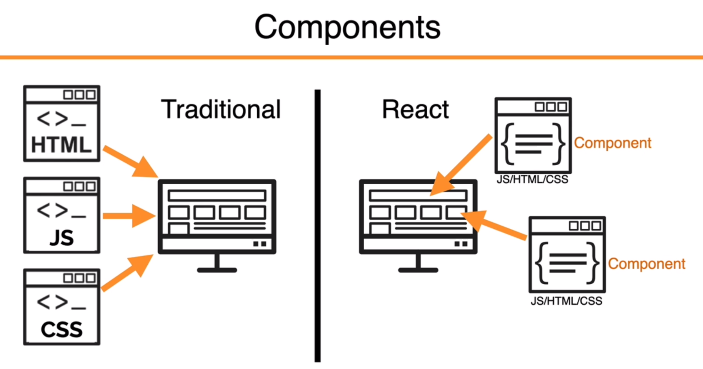
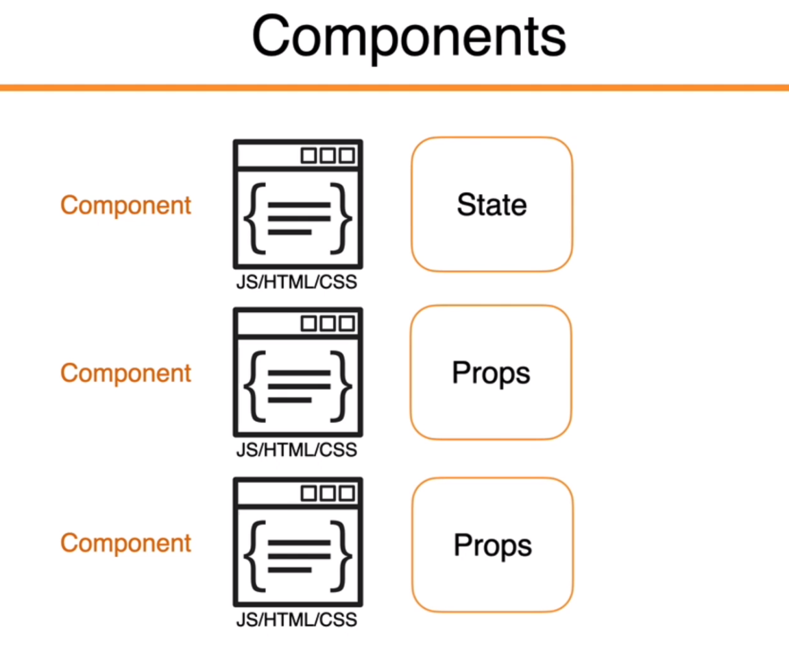
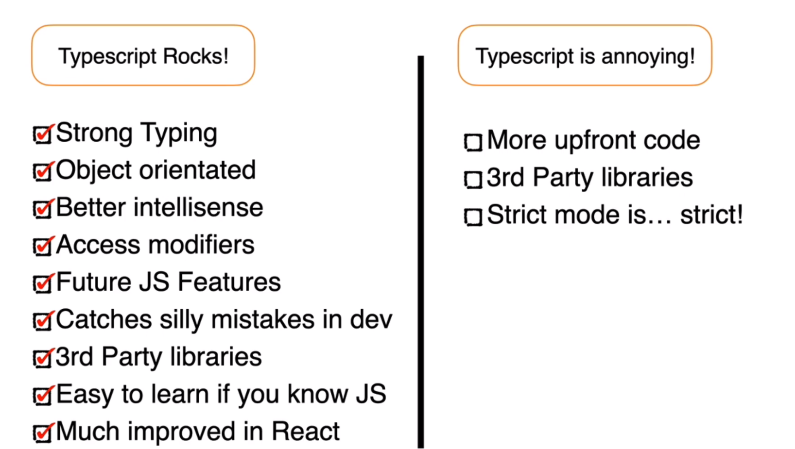

# API


1. **Program.cs** file:

   - The method `WebApplication.CreateBuilder(args)` is used to initiate a new web application builder. This is a new feature in .NET 6 that simplifies the setting and launching of an application.
   
   - Various services are added to the dependency injection container, including controllers, API explorers, Swagger generators, and the `DataContext` database context. These services will be used in subsequent processing.
   
   - The `UseSqlite()` method is used to configure EF Core to use the SQLite database, and the `GetConnectionString()` method is used to obtain the database connection string from the configuration files.
   
   - If the application environment is in development mode, Swagger is enabled. Swagger is a tool that aids in the building, documenting, and testing of RESTful APIs.
   
   - During the startup of the application, database migration and data seeding are performed. If an error occurs during the migration, the error is logged using the logger service.

2. **BaseApiController.cs** file:

   - This file defines a base controller class named `BaseApiController`. The class is adorned with the `[ApiController]` and `[Route]` attributes, and all controller classes derived from this base class will inherit these attributes. The `[ApiController]` attribute marks the class as a controller class, and the `[Route]` attribute defines the routing template, where `[controller]` gets replaced by the derived controller's class name minus "Controller".

3. **ActivitiesController.cs** file:

   - This file defines a controller that inherits from `BaseApiController`, so it automatically acquires the `[ApiController]` and `[Route]` attributes.
   
   - A `DataContext` instance `_context` is injected into this controller, which will be used for database access in subsequent operations.
   
   - Two action methods are provided: one for getting a list of all activities, and the other for getting a single activity by a specified ID. Both methods are marked with the HTTP method attribute `HttpGet`, meaning they will handle HTTP GET requests.


# Client

```
npx create-react-app client-app --use-npm --template typescript
```






## In React, `useState` and `useEffect` 

1. **useState**: This hook allows you to add state to functional components. It is a direct replacement for `this.state` and `this.setState` in class components. It returns an array containing the current state value and a function to update it.

Here's an example of `useState`:

```jsx
import React, { useState } from 'react';

function Counter() {
  const [count, setCount] = useState(0);

  return (
    <div>
      <p>You clicked {count} times</p>
      <button onClick={() => setCount(count + 1)}>
        Click me
      </button>
    </div>
  );
}
```

In the example above, `count` is the state variable, and `setCount` is the function that updates the state variable. The `useState` hook initializes `count` to zero.

2. **useEffect**: This hook allows you to perform side effects in your components. It is a direct replacement for lifecycle methods like `componentDidMount`, `componentDidUpdate`, and `componentWillUnmount` in class components.

Here's an example of `useEffect`:

```jsx
import React, { useState, useEffect } from 'react';

function Counter() {
  const [count, setCount] = useState(0);

  // Similar to componentDidMount and componentDidUpdate:
  useEffect(() => {
    // Update the document title using the browser API
    document.title = `You clicked ${count} times`;
  });

  return (
    <div>
      <p>You clicked {count} times</p>
      <button onClick={() => setCount(count + 1)}>
        Click me
      </button>
    </div>
  );
}
```

In the example above, the `useEffect` hook runs after every render when the `count` state changes, updating the document title.


`useEffect` is a hook in React that allows you to perform side effect operations within function components. Side effects are operations that have an impact outside of the function, such as data fetching, subscriptions, or manually changing the React component's DOM.

The basic syntax of `useEffect` is as follows:

```jsx
useEffect(() => {
  // Perform your side effect code here
}, [/* dependencies list */]);
```

## Talk About useEffect() Deeper
`useEffect` hook takes two parameters: the first is a function where you can perform the side effect operations; the second is an array known as the dependencies list. React will track all the variables listed in this array and re-run the side effect function whenever any of these variables change.

If you don't provide a second parameter, `useEffect` will run the side effect function after every render (i.e., after the initial render and each update render).

If you provide an empty array `[]` as the second parameter, `useEffect` will only run the side effect function after the initial render, and not on subsequent update renders, similar to the `componentDidMount` lifecycle method in class components.

If you list some variables in the array, `useEffect` will re-run the side effect function whenever any of these variables change.

Within the side effect function, you can optionally return a function. This returned function will be executed before the component unmounts, or before the next side effect function runs. It's similar to the `componentWillUnmount` lifecycle method in class components and can be used to clean up side effects, such as canceling subscriptions.

Here's an example of `useEffect` for fetching user data:

```jsx
import React, { useState, useEffect } from 'react';

function UserProfile({ userId }) {
  const [user, setUser] = useState(null);

  useEffect(() => {
    const fetchUser = async () => {
      const response = await fetch(`/api/users/${userId}`);
      const data = await response.json();
      setUser(data);
    };
    fetchUser();
  }, [userId]);  // When userId changes, re-fetch user data

  if (user) {
    return <div>{user.name}</div>;
  } else {
    return <div>Loading...</div>;
  }
}
```

In this example, when the `userId` changes, `useEffect` triggers the operation to re-fetch the user data.


The `fetchUser();` line of code is simply a function call. Here's a breakdown of the surrounding structure:

1. `fetchUser` is defined as an `async` function inside the `useEffect` hook. It uses the `fetch` API to get data from the `/api/users/${userId}` URL, where `${userId}` is a placeholder for the user ID passed as a prop to the `UserProfile` component.

    ```jsx
    const fetchUser = async () => {
      const response = await fetch(`/api/users/${userId}`);
      const data = await response.json();
      setUser(data);
    };
    ```

    The `async/await` syntax is used here to handle the Promise returned by the `fetch` API in an asynchronous manner, allowing the function to wait for the Promise to resolve before moving on to the next line of code. 

    The `response.json()` line is also asynchronous, as it waits for the entire response body to be read before it's parsed into a JavaScript object.

    Once the data is fetched and parsed, the `setUser` function (from the `useState` hook) is called to update the `user` state with the fetched data.

2. After the `fetchUser` function is defined, it's immediately called with the line `fetchUser();`. This line initiates the data fetching process.

This pattern of defining an `async` function inside a `useEffect` hook and then immediately calling it is quite common in React, because the `useEffect` hook itself cannot be made asynchronous. This pattern allows you to handle asynchronous operations, like data fetching, inside a `useEffect` hook.


## TypeScript




## Axios & Fetch

`fetch` and `axios` are both JavaScript libraries used for making HTTP requests in the browser. Although they can be used for the same tasks, there are some differences between them. 

Here are some of the main differences between `fetch` and `axios`:

1. **Error Handling**: `fetch` only rejects a promise when a network failure or anything that prevented the request from completing occurs. It won't reject if the HTTP status code indicates a failure, such as 404 or 500. You have to handle these cases yourself. On the other hand, `axios` automatically rejects the promise if the HTTP status code indicates a failure, making error handling easier.

2. **Browser Compatibility**: `fetch` is a newer API, and some older browsers may not support it (e.g., Internet Explorer). However, `axios` is supported in all modern browsers and even some older ones, including Internet Explorer.

3. **Data Parsing**: With `fetch`, you need to manually parse the returned JSON data, like this: `fetch(url).then(response => response.json())`. In contrast, `axios` automatically transforms the response data to JSON, so you can directly receive JSON data like this: `axios(url).then(response => console.log(response.data))`.

4. **Timeouts**: `axios` allows you to set a request timeout, but `fetch` doesn't.

5. **Cancellation**: `axios` provides a simpler way to cancel requests. While `fetch` doesn't support cancellation directly, it can be achieved through the `AbortController` API.

6. **XSRF Protection**: `axios` has a built-in mechanism to defend against cross-site request forgery (XSRF).

## CORS Policy

`Access to XMLHttpRequest at 'http://localhost:5000/api/activities' from origin 'http://localhost:3000' has been blocked by CORS policy: No 'Access-Control-Allow-Origin' header is present on the requested resource.`

CORS, or Cross-Origin Resource Sharing, is a mechanism that allows many resources (e.g., fonts, JavaScript, etc.) on a web page to be requested from another domain outside the domain from which the resource originated.

In the context of web applications, the term "origin" is defined as a combination of URI scheme (http, https), hostname (example.com), and port number (3000). When a document or script from one origin attempts to access resources from another origin, the browser's same-origin policy comes into play. The same-origin policy is a security measure that restricts how a document or script loaded from one origin can interact with a resource from another origin.

To mitigate this, CORS was introduced to allow controlled access to resources located outside of a given origin. In simple terms, CORS handles cross-origin requests by adding specific HTTP headers that tell the browser if it's permissible to access the requested resource.

In your case, the error message indicates that an XMLHttpRequest to 'http://localhost:5000/api/activities' from 'http://localhost:3000' was blocked by the browser due to the server's CORS policy. The server at 'http://localhost:5000' does not include the necessary Access-Control-Allow-Origin header in its response, so the browser denies the request.

```cs
builder.Services.AddCors(opt => 
{
    opt.AddPolicy("CorsPolicy", policy =>
    {
        policy.AllowAnyMethod().AllowAnyHeader().WithOrigins("http://localhost:3000");
    });
});


app.UseCors("CorsPolicy");
```

## React.StrictMode

`<React.StrictMode>` 是一个用于帮助开发人员在开发过程中检查潜在问题的React包装组件。这个组件不会对生产环境的构建产生影响，只会在开发模式下运行，帮助你找出应用中的潜在问题。

它主要进行以下检查：

1. **识别过时或不建议使用的生命周期方法：** 如 `componentWillMount`，`componentWillReceiveProps` 和 `componentWillUpdate` 这些在 React 17 之后将会被弃用的生命周期方法。使用了这些方法的组件在严格模式下会在控制台中打印警告。

2. **警告使用了不安全的生命周期钩子：** `<React.StrictMode>` 会帮助找出应用中使用了不安全的生命周期钩子的地方。

3. **检查意外的副作用：** 严格模式下，生命周期方法以及 `render` 方法会被执行两次（这只会在开发模式下发生，不会影响生产环境）。这有助于开发者捕获到在这些方法中可能出现的意外副作用。

4. **检查使用过时的 context API：** 新的 Context API 是 React 16.3 版本新添加的，如果你的项目中还在使用过时的 context API，`<React.StrictMode>` 会在控制台中打印警告。

5. **检测是否有使用废弃的ref API：** 早期的版本中，字符串（legacy string ref）被用作 ref ，现在已经被回调函数和 `createRef` API 取代。如果你的应用中仍然使用了字符串 ref ，`<React.StrictMode>` 会在控制台打印警告。

6. **检查是否在组件中误用了 DOM 属性：** 例如，某些无效的属性值被传递给了 DOM 的元素。

这些检查有助于发现和修正开发过程中可能犯的错误，让应用的代码质量更高、更易于维护。


## Semantic UI


`npm install semantic-ui-react semantic-ui-css`

`import 'semantic-ui-css/semantic.min.css'`

